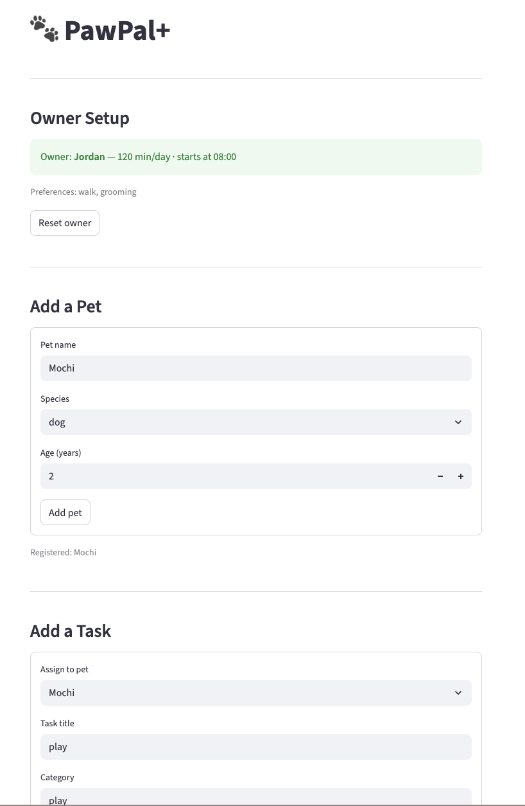
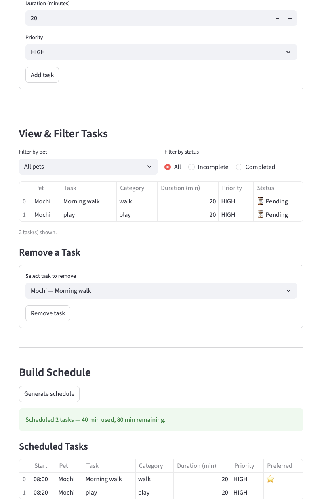

# PawPal+ (Module 2 Project)

You are building **PawPal+**, a Streamlit app that helps a pet owner plan care tasks for their pet.

## 📸 Demo




## Scenario

A busy pet owner needs help staying consistent with pet care. They want an assistant that can:

- Track pet care tasks (walks, feeding, meds, enrichment, grooming, etc.)
- Consider constraints (time available, priority, owner preferences)
- Produce a daily plan and explain why it chose that plan

Your job is to design the system first (UML), then implement the logic in Python, then connect it to the Streamlit UI.

## What you will build

Your final app should:

- Let a user enter basic owner + pet info
- Let a user add/edit/remove tasks (duration + priority at minimum)
- Generate a daily schedule/plan based on constraints and priorities
- Display the plan clearly (and ideally explain the reasoning)
- Include tests for the most important scheduling behaviors

## Getting started

### Setup

```bash
python -m venv .venv
source .venv/bin/activate  # Windows: .venv\Scripts\activate
pip install -r requirements.txt
```

## Features

### Priority-based sort with preference boosting
Tasks are sorted before scheduling using a three-key comparator:

1. **Priority** (HIGH > MEDIUM > LOW) — the primary sort key.
2. **Preferred category** — tasks whose category matches the owner's stated preferences (e.g., "walk", "grooming") are promoted as a tiebreaker, so equal-priority tasks the owner cares about most go first.
3. **Duration** (longer first) — a final tiebreaker that tends to maximize time utilization.

### Calculated start times
Each scheduled task receives a concrete `start_time` (e.g., `08:30`) derived from the owner's **session start** anchor (stored internally as minutes since midnight). Times increment sequentially as tasks are placed, so the full schedule reads like a real daily plan.

### Two-pass greedy scheduling
The scheduler runs two passes over the sorted task list:

- **First pass** — tasks are placed in priority order; any task that doesn't fit the remaining budget is skipped and queued for pass two.
- **Second pass** — skipped tasks are re-sorted by the same comparator and placed into any remaining time gaps. This maximizes session utilization without backtracking.

Tasks that survive both passes are split into two buckets: `deferred` (would fit in a longer session) and `too_long` (exceed the owner's total daily budget entirely).

### Conflict detection
`Scheduler.detect_conflicts()` checks every pair of scheduled entries for time overlaps using interval arithmetic (`a_start < b_end and b_start < a_end`). Conflicts are returned as human-readable warning strings and displayed prominently in the UI with actionable resolution tips.

### Daily (and weekly) recurrence
Tasks can carry a `frequency` of `"daily"` or `"weekly"`. When `Pet.complete_task()` is called, it invokes `Task.mark_complete()`, which:

- Marks the current task done.
- Computes the next due date by advancing from `due_date` (or today if unset) by one day or one week using `timedelta`.
- Returns a fresh `Task` instance (new UUID, `completed=False`) that is automatically added to the pet's task list.

### Task filtering
`Owner.get_tasks()` accepts optional `completed` and `pet_name` filters, letting the UI display subsets of tasks (e.g., only incomplete tasks for a specific pet) without exposing raw task lists directly.

### Task removal
The "View & Filter Tasks" section includes a **Remove a Task** form. A dropdown lists every task across all pets as `"PetName — Task Title"`; submitting the form calls `Pet.remove_task()`, unassigns the task, and invalidates the cached schedule so the next generated plan reflects the deletion.

---

## Smarter Scheduling

Since the initial build, the scheduling system has been extended with several improvements:

- **Two-pass greedy scheduling** — tasks that don't fit in the first pass are re-evaluated in a second pass to fill any remaining time, maximizing session utilization.
- **Session start time** — the owner can set a session start (e.g., `08:00`); all scheduled tasks receive a calculated `start_time` based on that anchor.
- **Preferred category boosting** — the owner's preferred task categories (e.g., "feeding", "exercise") are promoted in sort order as a tiebreaker between tasks of equal priority and duration.
- **Deferred vs. too-long classification** — skipped tasks are split into two buckets: tasks that could fit in a longer session (`deferred`) and tasks that exceed the owner's total available time entirely (`too_long`).
- **Conflict detection** — `detect_conflicts` checks all scheduled entries for time overlaps and returns warning strings, making it possible to flag invalid schedules passed in from external sources.
- **Recurring tasks** — tasks can be marked `daily` or `weekly`; completing one automatically generates the next occurrence with an advanced due date.
- **Task filtering** — `Owner.get_tasks()` supports filtering by completion status and/or pet name across all registered pets.

## Testing PawPal+

**Reliability: 5/5 stars** — 37/37 tests passing across all core behaviors.

Run the full test suite with:

```bash
python3 -m pytest tests/test_pawpal.py -v
```

The tests cover five core areas:

- **Task validation** — rejects invalid duration, frequency, and pet age values at creation time.
- **Recurring task logic** — verifies that completing a daily or weekly task generates a new task with the correct advanced due date, including edge cases where the due date is in the past or unset.
- **Task assignment rules** — confirms a task cannot be assigned to more than one pet, and that removing or completing a task correctly updates assignment state.
- **Scheduler behavior** — checks that tasks are sorted by priority and preferred category, that the time budget is respected, that the second pass fills remaining gaps, and that tasks exceeding the total budget land in `too_long` rather than `deferred`. Also verifies that scheduled start times are in chronological order.
- **Conflict detection** — tests `detect_conflicts` directly with overlapping and sequential entries, and confirms `build_plan` produces no warnings for a normally scheduled session.
- **Owner registration rules** — enforces that a pet cannot be registered to two owners, duplicate pet names are rejected (case-insensitive), and that `get_tasks` filtering by completion status and pet name works correctly.

### Suggested workflow

1. Read the scenario carefully and identify requirements and edge cases.
2. Draft a UML diagram (classes, attributes, methods, relationships).
3. Convert UML into Python class stubs (no logic yet).
4. Implement scheduling logic in small increments.
5. Add tests to verify key behaviors.
6. Connect your logic to the Streamlit UI in `app.py`.
7. Refine UML so it matches what you actually built.
